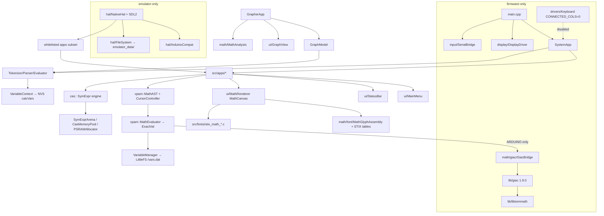

# NumOS — Architecture Ground Truth

> Authoritative description of the **actual current architecture** of NumOS, derived from source, build files, tests, CI, and runtime verification — not from README/PROJECT_BIBLE claims.
>
> Audit date: 2026-07-01 · Branch: `claude/numos-architecture-audit-hqx6y9` (clean tree, based on `main` @ `8662f47`)
> Verification level: static audit of all of `src/`, `lib/`, `tests/`, `scripts/`, `.github/` + **live verification**: `pio run -e emulator_pc` built successfully on Linux (56.8 s), the `.numos` script harness executed `calc_1_plus_2.numos` with exit 0, and `scripts/compare-ppm.py` reproduced the committed golden byte-identically after masking (1 rect, 481 px). Firmware env was **not** built locally (ESP32 toolchain not installed here); firmware build health is evidenced by GitHub Actions: `Build and Release NumOS` **success** on `main` @ `8662f47` (2026-06-30).

---

## A. Executive summary

### What NumOS currently is

NumOS is a C++17 scientific-calculator OS for the **ESP32-S3 N16R8** (16 MB QIO flash, 8 MB OPI PSRAM) with an **ILI9341 320×240** display, built on **LVGL 9.5.0** (resolved from `lvgl/lvgl@^9.2.0`, `platformio.ini:107`; resolution verified in `.pio/libdeps/emulator_pc/lvgl/library.json`). It has two entry points compiled from the same app/UI/math sources:

- **Firmware**: `src/main.cpp:23-242` (`#ifdef ARDUINO`) → `SystemApp` orchestrator (`src/SystemApp.h:106-227`, `src/SystemApp.cpp`, 1089 lines).
- **Desktop emulator**: `src/hal/NativeHal.cpp` (2158 lines, `#ifndef ARDUINO`/`NATIVE_SIM`) — SDL2 window, deterministic tick, `.numos` script replay, PPM screenshots, semantic assertions.

Math is a **three-engine stack**: (1) the VPAM structural editor/evaluator (`vpam::` — `MathAST`/`MathEvaluator`/`ExactVal`), (2) a legacy string→RPN→double pipeline (`Tokenizer`/`Parser`/`Evaluator`) used by the Grapher, and (3) an in-tree symbolic CAS (`cas::`, 59 files / 20,242 lines) plus **Giac 1.9.0** (KhiCAS build, `lib/giac`, 147 source files, ~185k lines incl. headers) linked into firmware only.

### What works now (verified)

- Firmware builds green in CI with Giac linked (`compile-and-release.yml:53`; run success 2026-06-30).
- Emulator builds and runs on Linux (verified in this audit) and in CI (`emulator-build.yml`; latest run success 2026-06-29).
- Deterministic emulator harness: script replay is byte-reproducible; 20 goldens + 19 masks + 71 scripts under `tests/emulator/`; golden mismatches **fail** CI (`emulator-build.yml:599`).
- Apps with emulator + CI coverage: Calculation, Grapher, Statistics, Probability, Sequences, Regression, Settings, Math Showcase, launcher navigation.
- VPAM natural-display editing/rendering with STIX Two Math fonts, exact results (`ExactVal`), S⇔D result modes.

### What is partially working

- **Physical keyboard: scanning is disabled.** `src/drivers/Keyboard.h:82` → `static constexpr int CONNECTED_COLS = 0; // ← 0 = escaneo desactivado`. All firmware input currently arrives via `SerialBridge` (`src/main.cpp:227-230`). `src/Config.h:68` (`KBD_CONNECTED_COLS = 3`) is stale relative to the driver constant actually used (`Keyboard.cpp:84,135` loop over `CONNECTED_COLS`).
- **Giac**: firmware-only, real-mode, exact-mode (`complex_mode(false)`, `src/math/giac/GiacBridge.cpp:197`); reachable via `MathEvaluator.cpp` and `SerialBridge.cpp`; zero automated tests exercise it.
- **In-tree CAS**: functional (edu-steps in CalculationApp, solvers in EquationsApp) but its 8 unit-test suites are compile-gated behind `-DCAS_RUN_TESTS` (`src/main.cpp:55-64,104-113`) which **no build or CI job ever sets**.
- **LuaVM** (CircuitCore MCU scripting): stub — `src/apps/LuaVM.cpp` stores scripts but does not execute ("Lua not available (stub mode)").
- **PythonApp**: full LVGL IDE, but `PythonEngine` is a custom line-by-line interpreter (print / assignment / for / basic math), **not** MicroPython (`src/apps/PythonEngine.cpp` header comment).

### What is aspirational / documented but not real

- "CAS Engine: Active Production" (`docs/PROJECT_BIBLE.md:6`) — README is more honest: "Experimental / in progress — not a validated CAS" (README.md, Giac backend row).
- Battery monitoring: `StatusBar::setBatteryLevel()` exists (`src/ui/StatusBar.h:74`) but no ADC sampling anywhere; icon level is hardcoded.
- Native (emulator) Giac: explicitly deferred (`platformio.ini:179-185` comment); emulator baseline is "CAS unavailable via Giac".
- Wokwi sim: `wokwi.toml` points at `.pio/build/esp32dev/` (nonexistent env) and `diagram.json` uses an ESP32 (non-S3) with wrong pins — both dead config.
- `lib/mdx.ts`, `lib/utils.ts`: orphaned Next.js/Tailwind website artifacts in a firmware repo; nothing consumes them.

### Top 10 architectural truths a future agent must know before editing

1. **Two entry points, one app codebase.** Firmware = `main.cpp`+`SystemApp`; emulator = `NativeHal.cpp` with its **own** app registry, mode enum, and dispatch (`NativeHal.cpp:195-206`). A feature added to `SystemApp` does not exist in the emulator until mirrored in `NativeHal.cpp`, and vice versa.
2. **Emulator compiles a whitelist, not the tree.** `platformio.ini:195-266` `build_src_filter` lists individual files. Firmware compiles everything (`+<*>`, line 103). Apps NOT in the emulator: Equations, Calculus, Matrices, Python, PeriodicTable, Bridge, Circuit, Fluid2D, ParticleLab, NeuralLab, OpticsLab, NeoLanguage, Fractal.
3. **KeyCode digits are non-contiguous** (`src/input/KeyCodes.h:68-77`: NUM_7..9, NUM_4..6, NUM_1..3, then `ADD, NEG, NUM_0`). `code - NUM_0` and range tests are banned; use `keyCodeDigitValue()` (`KeyCodes.h:127-141`). CI gates this (`emulator-build.yml:96-104`).
4. **LVGL draw buffer must be a single 32 KB internal-DMA buffer** (`main.cpp:138-142`). PSRAM buffers → silent black screen / StoreProhibited; double buffering → LVGL 9 pipelining deadlock (`main.cpp:131-137`).
5. **App teardown is deferred ~250 ms** after returnToMenu on both targets (`SystemApp.h:180-186`, `SystemApp.cpp:229-239`; `NativeHal.cpp` Phase 9F deferred teardown). Synchronous `lv_obj_delete` during the menu FADE_IN animation caused hard hangs (PROJECT_BIBLE §11 last two rows document the incident).
6. **Golden screenshots are byte-exact by design.** Deterministic tick (`--deterministic`, synthetic `g_detTick`) + P6 PPM + optional pixel masks. Any renderer/layout/font change invalidates goldens; re-blessing is a deliberate human action (`scripts/promote-emulator-golden.py`, deliberately never run by CI — `emulator-build.yml:26`).
7. **Giac is ARDUINO-only.** The only call path is `MathEvaluator.cpp:45` → `src/math/giac/GiacBridge.h` → `solveWithGiac()` under `#ifdef ARDUINO`; emulator hard-excludes `giac`/`libtommath` via `lib_ignore` (`platformio.ini:192-194`) because Giac does not compile natively (`SIZEOF_INT` config divergence, noted `platformio.ini:179-185`).
8. **Two variable stores that do not sync**: `VariableManager` (singleton, `ExactVal`, LittleFS `/vars.dat`, `src/math/VariableManager.h`) vs `VariableContext` (per-instance, `double`, NVS namespace `"calcVars"`, `src/math/VariableContext.h:61-70`).
9. **`build_dir = C:/.piobuild/numOS`** (`platformio.ini:6`) is a Windows path; on Linux/macOS it creates a literal `C:/` directory in the repo (observed in this audit). CI overrides with `PLATFORMIO_BUILD_DIR=.pio/build` (`emulator-build.yml:54-55`); local scripts and docs tell users to do the same.
10. **CAS unit tests never run anywhere.** 6.5k lines of tests in `tests/` are gated behind `-DCAS_RUN_TESTS` (never set); `MathEnginePhaseRegression.cpp` (2123 lines) and `TokenizerTest_temp.cpp` are referenced by nothing at all.

---

## B. Repository map

| Area | Purpose | Key files | Risk / notes |
|---|---|---|---|
| `src/` root | Firmware entry + orchestrator | `main.cpp` (243), `SystemApp.h/.cpp` (227/1089), `Config.h` (102, pinout + settings externs), `lv_conf.h` (278), `HardwareTest.cpp` (94, standalone) | High: SystemApp owns app lifecycle & deferred teardown |
| `src/apps/` | 20+ apps + engines + NeoLanguage stack (49,327 lines / 107 files) | Per-app `.h/.cpp` + engines (`StatsEngine`, `ProbEngine`, `RegressionEngine`, `MatrixEngine`, `ParticleEngine`, `NeuralEngine`, `OpticsEngine`, `MnaMatrix`, `PythonEngine`, `LuaVM`, `Neo*` 11k lines) | Mixed; sim apps allocate large PSRAM buffers; `TutorApp`/`IntegralApp` are dead (not instantiated by SystemApp) |
| `src/math/` | VPAM engine + legacy RPN engine (33,750 lines / 102 files incl. subdirs) | `MathAST.h/.cpp` (1466-line header), `MathEvaluator`, `ExactVal.h`, `CursorController`, `Tokenizer/Parser/Evaluator`, `VariableManager`/`VariableContext`, `MathAnalysis`, `EquationSolver`, fixtures `MathRenderVisualCases`/`MathStressExpressions` | High: renderer-coupled geometry, dual variable stores |
| `src/math/cas/` | In-tree symbolic CAS (20,242 lines / 59 files) | `SymExpr(Arena)`, `SymSimplify/Diff/Integrate/Poly(Multi)`, `OmniSolver/SingleSolver/SystemSolver/HybridNewton`, `RuleEngine/AlgebraicRules`, tutor stack, `CASInt/CASRational/CASNumber`, `CasMemory`, `PSRAMAllocator` | High: arena/lifetime contracts; test suites exist but never run |
| `src/math/giac/` | Giac adapter | `GiacBridge.h/.cpp` (441), `GiacAlloc.cpp` | Firmware-only; global Giac context config at `GiacBridge.cpp:192-211` |
| `src/math/font/` | STIX MATH table data + delimiter assembly | `stix_math_constants.h` (56 constants, UPM 1000), `stix_math_variants.h`, `stix_math_italics.h`, `MathGlyphAssembly.h/.cpp` | High: auto-generated by `scripts/extract_stix_math.py`; hand edits will be overwritten/wrong |
| `src/ui/` | LVGL UI layer (9,055 lines) | `MainMenu` (1050), `MathRenderer` (MathCanvas widget), `MathTypography`, `StatusBar`, `GraphView`, `SplashScreen`, `StixGlyphGallery`, `Theme.h`, `Icons.h` | High: MathRenderer geometry ↔ goldens; StatusBar lifetime contract |
| `src/hal/` | Emulator HAL (2,673 lines) | `NativeHal.cpp` (2158 — SDL2, script harness, app registry), `ArduinoCompat.h` (String/millis/Serial/PSRAM stubs), `FileSystem.h/.cpp` (LittleFS→`./emulator_data/`), `Hal.h` | High: firmware/emulator divergence lives here |
| `src/input/` | Input abstraction | `KeyCodes.h` (enum + `keyCodeDigitValue`), `KeyboardManager` (SHIFT/ALPHA/STO modifier FSM, singleton), `LvglKeypad` (LVGL indev, 8-slot queue), `SerialBridge` (serial→KeyEvent), `NumosSerialBackend.h` (UART0 vs USB-CDC macro switch), `KeyMatrix` (legacy 6×8, unused) | Medium; KeyCode ordering is a protected invariant |
| `src/drivers/` | Physical keyboard driver | `Keyboard.h/.cpp` (5×10 matrix, 16-event queue, debounce/autorepeat) | **Scanning disabled**: `Keyboard.h:82` `CONNECTED_COLS = 0` |
| `src/display/` | Display driver | `DisplayDriver.h/.cpp` (TFT_eSPI wrapper + LVGL flush cb + DMA staging buffer) | High: DMA constraints (internal SRAM only) |
| `src/fonts/` | Generated LVGL fonts (71,556 lines / 6 files) | `stix_math_18/12/8.c`, `lv_font_montserrat_math_12/14.c`, `StixMathFont.h` | Generated artifacts — regenerate via `scripts/generate_*_font.sh`, never hand-edit |
| `src/utils/` | Small helpers | `ColorUtils.h`, `MemoryUtils.h`, `StringUtils.h` (231 lines) | Low |
| `src/lua/` | Vendored Lua 5.4 sources (28,838 lines / 63 files) | `src/lua/*`, `src/lua/manual/` | Compiled by firmware `+<*>` glob; only consumer (`LuaVM`) is stubbed — dead weight in the firmware image |
| `lib/giac` | Giac 1.9.0 KhiCAS (147 `.cc/.c/.h`, ~185k lines) | `library.json` (flags: `GIAC_KHICAS,NO_GUI,GIAC_GENERIC,EMBEDDED,USE_GMP_REPLACEMENTS,UMAP,-fexceptions`; src filter strips UI/ports) | Firmware-only; native build known-broken |
| `lib/libtommath` | Bignum backend for Giac (`USE_GMP_REPLACEMENTS`) | `mp_*.c`, `library.json` | Note: in-tree `CASInt` uses **mbedtls_mpi**, not libtommath (`CASInt.h:54`) |
| `lib/mdx.ts`, `lib/utils.ts` | Orphaned Next.js website artifacts | — | Cruft; nothing consumes them |
| `tests/` | CAS unit tests (root, 6.6k lines) + `tests/emulator/` (71 scripts / 20 goldens / 19 masks) + `tests/host/` (`keycode_digit_test.cpp`) | see §K | Root tests orphaned behind `-DCAS_RUN_TESTS`; host test runs in CI |
| `scripts/` | Emulator/CI tooling + font generation | `sdl2_env.py`, `compare-ppm.py`, `generate-emulator-candidates.py`, `promote-emulator-golden.py`, `check-keycode-digit-patterns.py`, `check-emulator-deps.py`, `run-emulator*.sh/.ps1`, `extract_stix_math.py`, `generate_*font*.sh` | Medium: comparator/candidate list must stay in sync with scripts/goldens |
| `docs/` | Documentation (mixed freshness) | `PROJECT_BIBLE.md` (898, partially stale — see delta doc), `NUMOS_MATH_ENGINE_SPEC.md`, `MATH_ENGINE.md`, `ROADMAP.md`, `emulator-sdl2-quickstart.md` (accurate), `HARDWARE.md`, `KEYBOARD_LAYOUT.md`, `math-renderer-acceptance.md`, `GLYPH_INVENTORY.md`, `NeoLanguage.md`, `es/` | Treat as possibly stale until checked against source |
| `.github/workflows/` | CI | `compile-and-release.yml` (firmware build+release on `main`), `emulator-build.yml` (emulator build + 9 gate phases + golden compare) | See §K |
| `platformio.ini` | 6 build environments | 266 lines | `build_dir` Windows path (line 6); emulator whitelist (195-266) |
| Top-level cruft | `build_output.log`, `pio_error.log` (stale UTF-16 Windows logs of an old failed build — the error at `TutorTemplates.cpp:25` no longer exists in source), `compile_commands.json` (23 MB generated), `User_Setup.h`, `wokwi.toml`+`diagram.json` (stale), `archive/`, `info/`, `emulator_data/`, `boards/esp32-s3-devkitc-1-n16r8.json` | Logs/`compile_commands.json` should be removed/ignored |

---

## C. Module dependency graph

### Textual graph (arrows = "depends on")

```
main.cpp ──► SystemApp ──► {all 20 apps} ──► ui/{MainMenu,StatusBar,MathRenderer,GraphView}
main.cpp ──► display/DisplayDriver ──► TFT_eSPI + LVGL
main.cpp ──► input/{SerialBridge,LvglKeypad,NumosSerialBackend} , drivers/Keyboard
SystemApp ──► math/{Tokenizer,Parser,Evaluator,VariableContext,EquationSolver,StepLogger}

CalculationApp ──► vpam::{MathAST,CursorController,MathEvaluator} ──► ExactVal, VariableManager
CalculationApp ──► cas::{ASTFlattener,SymSimplify,SymExprToAST,CASStepLogger}   (edu-steps)
EquationsApp   ──► cas::{SingleSolver,SystemSolver,SystemTutor,OmniSolver,...}
CalculusApp    ──► cas::{SymDiff,SymIntegrate,...}
GrapherApp ──► GraphModel ──► math/{Tokenizer,Parser,Evaluator,VariableContext}   (RPN doubles)
GrapherApp ──► ui/GraphView, math/MathAnalysis, vpam::MathAST (editor only)
MathEvaluator ──► giac/GiacBridge ──► lib/giac ──► lib/libtommath        (ARDUINO only)
cas::CASInt ──► mbedtls_mpi                                            (ARDUINO only)
ui/MathRenderer ──► math/font/{MathGlyphAssembly,stix_*}, src/fonts/stix_math_*.c
NativeHal (emulator) ──► SDL2, LVGL, hal/{ArduinoCompat,FileSystem}, whitelisted apps
```

### Mermaid



### Module → depends on → why

| Module | Depends on | Why |
|---|---|---|
| `SystemApp` | every app header (`SystemApp.h:42-65`) | owns instances, `launchApp(id)` switch (`SystemApp.cpp:870-891`), deferred teardown switch |
| `MainMenu` | LVGL, `Icons.h`, launch callback | renders `APPS[]` cards (`MainMenu.cpp:88-115`), keypad-group focus |
| `CalculationApp` | `vpam::` + `cas::` + `MathRenderer` + `KeyboardManager` | VPAM editing (`CalculationApp.cpp:88-186`), edu-steps via `cas::SymSimplify::simplifyPass` (`CalculationApp.cpp:919-964`) |
| `GrapherApp` | `GraphModel`, `GraphView`, `MathAnalysis`, `vpam::` editor | MVC: edits as MathAST, serializes to string, evaluates via RPN (`GraphModel.h:30-34`) |
| `GraphModel` | `Tokenizer/Parser/Evaluator`, `VariableContext` | caches RPN per function; implicit `G(x,y)=0` residual (`GraphModel.h:68-107`) |
| `MathEvaluator` | `ExactVal`, `VariableManager`, `Constants.h`, `GiacBridge` (ARDUINO) | AST→exact value; π/e PROGMEM digits; Giac escalation |
| `MathRenderer` | `MathAST` layout results, `MathGlyphAssembly`, STIX fonts, LVGL draw API | baseline-oriented recursive draw; `MAX_RENDER_DEPTH = 12` (`MathRenderer.h`) |
| `cas::*` | `SymExprArena`, `CASInt/CASRational`, `CasMemoryPool` | arena-allocated immutable hash-consed DAG |
| `NativeHal` | SDL2, LVGL, whitelisted apps, `MainMenu` debug hooks | emulator loop, `.numos` runner, `assert_*` reads `CalculationApp::debugLastResult` / `MainMenu::debugFocusedCardId` (NATIVE_SIM-only hooks, `CalculationApp.h:95-107`, `MainMenu.h:58-79`) |
| `GiacBridge` | `lib/giac`, global Giac context | `solveWithGiac()` parse→eval→prettify (`GiacBridge.cpp:389-440`) |

### Cycles / near-cycles

- **No true include cycles found.** Closest coupling knots:
  - `SystemApp ↔ apps`: SystemApp includes every app; apps signal exit via key interception (MODE handled by SystemApp before the app sees it) rather than callbacks — acceptable but makes SystemApp a god-object.
  - `MathRenderer ↔ MathAST`: layout metrics live in `MathAST.h` (`FontMetrics`, `LayoutResult`, `MathAST.h:208-459`) while drawing lives in `ui/MathRenderer.*`. Changing either side changes rendered geometry (and therefore goldens) — a *contract* cycle, not an include cycle.
  - `NativeHal → apps → (debug hooks) → NativeHal scripts`: emulator assertions depend on `debug*` accessors compiled into apps under `NATIVE_SIM`.

### Dependency safety classification

- **Safe**: apps → `StatusBar`/`KeyboardManager`/`KeyCodes`; engine-per-app pattern (StatsEngine, ProbEngine, RegressionEngine — pure `<cmath>`).
- **Dangerous**: anything → `MathRenderer` geometry (goldens); `MathEvaluator` → Giac (exceptions, memory); `cas::` arena pointers escaping `reset()` (`CasMemory.h:301-307` lifecycle contract); LVGL object deletion order (StatusBar-before-screen rule, PROJECT_BIBLE §2.3 rule, implemented per-app).
- **Accidental**: firmware `+<*>` glob compiles `src/lua/` (28.8k lines) for a stubbed consumer; `SystemApp.h` includes `KeyMatrix.h` "legacy — kept for compatibility" (`SystemApp.h:30`); `tests/` headers included from `main.cpp` via relative `../tests/` path (`main.cpp:56-63`) — source outside `src/` compiled only because headers are header-only test bodies… actually the `.cpp` bodies are only built when `CAS_RUN_TESTS` maps them in; the include-path coupling remains fragile.

---

## D. Runtime architecture

### Firmware runtime path

`setup()` (`main.cpp:83-211`), strict order: Serial begin (UART0 default; bounded 3 s wait only for USB-CDC variant, lines 89-96) → optional CAS test run (`CAS_RUN_TESTS`, lines 104-113) → PSRAM report (116-121) → `g_display.begin()` (124) → `lv_init()` + tick cb = `millis` (127-128) → **single 32 KB internal DMA draw buffer** (`heap_caps_malloc(MALLOC_CAP_INTERNAL|MALLOC_CAP_DMA)`, 138-150; PSRAM and double-buffering explicitly forbidden, comments 131-137) → `g_display.initLvgl` (153) → `LvglKeypad::init()` **after** display (160-164, LVGL 9 indev/display ordering constraint) → splash animation pumped to completion + 800 ms hold (170-185) → `g_app.begin()` (197: apps `new`ed but **not** `begin()`ed — lazy LVGL creation; comment `SystemApp.cpp:101-102`: calling begin() on all apps at boot exhausts the LVGL heap) → `g_serial.begin()` (200).

`loop()` (`main.cpp:220-240`): `lv_timer_handler()` if `g_lvglActive` → `g_app.update()` → drain `SerialBridge::pollEvent` into `g_app.injectKey` → 5 s heartbeat → `delay(KEY_SCAN_INTERVAL_MS)` (5 ms, `Config.h:71`).

### App lifecycle contract

Every app implements `begin() / end() / load() / handleKey(...) / update()` (PROJECT_BIBLE §2.3; enforced by `SystemApp::teardownModeNow` switch `SystemApp.cpp:181-208`). Lifecycle: constructor at boot (no LVGL) → `load()` lazily calls `begin()` → active → `returnToMenu()` records `_pendingTeardownMode` + timestamp (`SystemApp.cpp:856`) → `update()` calls `end()` ≥250 ms later (`SystemApp.cpp:229-239`), after the menu FADE_IN (200 ms) finished referencing the old screen. `end()` must destroy StatusBar before the screen and null LVGL pointers.

### MainMenu / StatusBar / LVGL model

- `MainMenu::APPS[]` (`MainMenu.cpp:88-115`) is the single source of truth for launcher cards: **20 entries (ids 0-19) + conditional id 20** under `NUMOS_MATH_VISUAL_VERIFY`. `buildGrid()` creates a card per entry (`MainMenu.cpp:409-416`); ENTER on a focused card fires the launch callback → `SystemApp::launchApp(id)` (`SystemApp.cpp:134,717`). **All ids 0-19 are therefore reachable on firmware.** The separate `SystemApp::_apps` vector (`initApps()`, `SystemApp.cpp:161-179`) excludes 11-18 with the comment "hidden/experimental" — that vector feeds only the **legacy non-LVGL renderMenu path**, not the LVGL launcher; the comment is stale/misleading.
- `StatusBar` (`src/ui/StatusBar.h/.cpp`): 24 px bar (HEIGHT=24) with clock, title, modifier indicator (from `KeyboardManager::indicatorText()`), DEG/RAD, 3-bar battery icon (no real ADC). Contract: `destroy()`/`resetPointers()` before parent screen deletion (troubleshooting row, PROJECT_BIBLE §11).

### Input flow

- **Hardware** (currently inert): `drivers/Keyboard` 5×10 matrix — rows GPIO {1,2,41,42,40} OUTPUT, cols GPIO {6,7,8,3,15,16,17,18,21,47} INPUT_PULLUP (`Config.h:60-64`); 5 ms scan / 20 ms debounce / 500 ms + 80 ms autorepeat (`Config.h:71-74`); 16-slot queue. Disabled by `CONNECTED_COLS = 0` (`Keyboard.h:82`).
- **Serial**: `SerialBridge` maps monitor chars (w/a/s/d, digits, operators, `h`=MODE…) to `KeyEvent`s → `SystemApp::injectKey` (`main.cpp:227-230`). Serial backend is UART0 by default (`-DNUMOS_SERIAL_BACKEND_UART0=1`, `platformio.ini:47`), switchable to USB-CDC by the `_usbcdc` env.
- **LVGL widgets**: `LvglKeypad` (indev KEYPAD, 8-slot ring queue) feeds the focused LVGL group (menu cards, textareas).
- **Emulator**: SDL keydown/textinput → `mapSdlToKeyCode`/`mapTextChar` (`NativeHal.cpp:308-434`) → same `dispatchKey` path apps see; scripts inject via `scriptNameToKeyCode` (`NativeHal.cpp:446-555`).

### Storage / persistence model

| Store | Backend | Writer/reader | File/namespace |
|---|---|---|---|
| VPAM variables (Ans, PreAns, A-F, x, y, z as `ExactVal`) | LittleFS | `VariableManager` singleton (`saveToFlash/loadFromFlash`) | `/vars.dat` |
| Legacy variables A-Z + Ans as `double` | NVS/Preferences | `VariableContext` (`VariableContext.h:61-70`, magic `0xC41234`) | namespace `calcVars`, key `vars` |
| Settings (`setting_complex_enabled`, `setting_decimal_precision`, `setting_edu_steps`) | globals defined in `main.cpp:31-33` (firmware) / `NativeHal.cpp:125-127` (emulator); declared `extern` in `Config.h:77-79` | SettingsApp | — |
| Python scripts | LittleFS | PythonApp | `/scripts/*.py` |
| Circuit autosave | LittleFS | CircuitCoreApp | `/circuit.bin` |
| ParticleLab quicksave | LittleFS | ParticleLabApp | `/save.pt` |
| NeoLanguage program | LittleFS | NeoLanguageApp | `/neolang.nl` |
| Emulator FS | stdio under `./emulator_data/` | `hal/FileSystem` (`FileSystem.cpp:38-85`) | same logical paths |

### Emulator runtime path & screenshot/golden pipeline

`NativeHal.cpp` main: SDL init (1889-1973; 320×240 logical size, integer scale, default 2×) → `lv_init`, tick = `SDL_GetTicks` or synthetic `g_detTick` under `--deterministic` (1988, step default 16 ms) → `lv_display_create(320,240)` RENDER_MODE_FULL, flush cb copies RGB565 to SDL texture and defers `SDL_RenderPresent` outside `lv_timer_handler` (285-303, 2059-2064). Main loop (2035-2107): script step → SDL events → deferred splash→menu transition → tick advance → `lv_timer_handler` → present → deferred screenshot capture → deferred app teardown (Phase 9F) → auto-exit on `--frames`/`--run-for-ms`.

`.numos` command vocabulary (`NativeHal.cpp:1447-1612`): `wait N`, `key/keydown/keyup NAME`, `screenshot PATH`, `log "…"`, `open_app NAME`, `assert_app`, `assert_result[_contains]`, `assert_no_error`, `assert_error`, `assert_variable`, `assert_menu_focus`. Whole script is parse-validated up front (exit 2 on error); assertion failure exits 4; screenshot write failure exits 3. Assertions are **semantic** (read app debug state), not OCR.

Golden pipeline: `scripts/generate-emulator-candidates.py` runs a fixed list of 43 candidate stems (`generate-emulator-candidates.py:39-143`) headless+deterministic → validates P6 320×240 (230,415 bytes) → `scripts/compare-ppm.py` compares candidate vs `tests/emulator/golden/<stem>.ppm`, with optional `tests/emulator/masks/<stem>.mask` rectangles (format `x,y,w,h` per line) to ignore blinking-cursor/clock regions; mismatch = CI failure, missing golden = warning (`emulator-build.yml:575-607`). Promotion to golden is human-only via `scripts/promote-emulator-golden.py` (refuses overwrite without `--force`, never invoked by CI).

---

## E. Build architecture (PlatformIO environments)

Global: `build_dir = C:/.piobuild/numOS` (`platformio.ini:6`) — see risk R-9. `boards_dir = boards` provides the custom `esp32-s3-devkitc-1-n16r8.json`.

| Env | Purpose | Key flags (delta) | Sources | Excluded | Traps |
|---|---|---|---|---|---|
| `esp32s3_n16r8` (`platformio.ini:9-110`) | Production firmware | `-std=gnu++17`, `-DDOUBLEVAL`, `-DBOARD_HAS_PSRAM`, `-mfix-esp32-psram-cache-issue`, `ARDUINO_LOOP_STACK_SIZE=65536`, `ARDUINO_USB_MODE=0`, `ARDUINO_USB_CDC_ON_BOOT=0`, `NUMOS_SERIAL_BACKEND_UART0=1`; TFT_eSPI: ILI9341, BGR, 240×320, FSPI, MOSI13/SCLK12/CS10/DC4/RST5/BL45, `SPI_FREQUENCY=40000000`; LVGL asm off; Giac: `NUMOS_USE_GIAC=1, GIAC_KHICAS, NO_GUI, GIAC_GENERIC, EMBEDDED, UMAP, -fexceptions` (re-enabled: `build_unflags` removes `-fno-exceptions -fno-rtti -std=gnu++11`) | `+<*>` (everything under `src/`), `lib_deps`: TFT_eSPI, `lvgl@^9.2.0` (resolves 9.5.0), `file://lib/giac`, `file://lib/libtommath`; `lib_ldf_mode=deep+`, `lib_archive=no` | nothing | Giac needs exceptions; `qio_opi` memory type mandatory; partitions `default_16MB.csv`; LittleFS filesystem |
| `esp32s3_n16r8_validate` (116-121) | Math-renderer hardware validation | + `NUMOS_MATH_VISUAL_VERIFY=1` (enables MathRenderVisualTestApp + launcher card id 20), `NUMOS_MATH_RENDER_TRACE_ONCE=1` (one-shot coordinate trace in MathRenderer) | inherits | — | Changes launcher card count → menu goldens/screens differ from production |
| `..._validate_overlay` (127-131) | Ink-bounds debug | + `NUMOS_MATH_INK_OVERLAY=1` (draws glyph ink boxes) | inherits | — | Diagnostic rendering; never compare with goldens |
| `..._validate_sup1` (133-137) | Superscript tuning A/B | + `NUMOS_SUPERSCRIPT_VPAM_ADJUST_PX=1` (shifts exponent placement, `MathAST.h:390-399`) | inherits | — | Geometry differs by design |
| `..._validate_usbcdc` (139-150) | Same validation over native USB serial | unflags UART0 backend; + `ARDUINO_USB_MODE=1, ARDUINO_USB_CDC_ON_BOOT=1, NUMOS_SERIAL_BACKEND_USB_CDC=1` | inherits | — | Boot waits up to 3 s for CDC (`main.cpp:89-93`); monitor behavior differs |
| `emulator_pc` (153-266) | SDL2 desktop emulator | `-DNATIVE_SIM`, `-D_USE_MATH_DEFINES`, `-std=c++17`, LVGL asm off, **`-DLV_USE_STDLIB_MALLOC=LV_STDLIB_CLIB`** (LVGL 9 ignores the LVGL-8-style `LV_MEM_CUSTOM` in `lv_conf.h`; without this the 64 KB builtin pool exhausts on 64-bit and hangs — comment 170-176); SDL2 flags injected by `extra_scripts = pre:scripts/sdl2_env.py` | explicit whitelist (195-266): hal/*, CalculationApp, SettingsApp, Statistics+StatsEngine, Probability+ProbEngine, Sequences, Regression+Engine, Grapher+GraphModel+GraphView, Tokenizer/Parser/Evaluator/VariableContext, MathAnalysis, LvglKeypad, KeyboardManager, MathAST, MathGlyphAssembly, CursorController, MathEvaluator, VariableManager, MathRenderVisualCases, cas/{ASTFlattener,SymSimplify,SymExprToAST,SymExpr,ConsTable,CASStepLogger,SymPoly}, ui/{StatusBar,MathRenderer,MathTypography,SplashScreen,MainMenu}, fonts/stix_math_{18,12,8}.c | **`lib_ignore = giac, libtommath`** (192-194); every app not whitelisted; `main.cpp`/`SystemApp` (excluded by `#ifdef ARDUINO` guards + filter) | Giac cannot compile natively (`SIZEOF_INT` divergence, 179-185); on Linux the Windows `build_dir` becomes a literal `C:/` dir in repo root (observed); Windows needs SDL2 at `NUMOS_SDL2_ROOT`/`C:/SDL2/x86_64-w64-mingw32` (`sdl2_env.py:62-111`) |

**Firmware vs emulator divergence summary**: entry point (`main.cpp` vs `NativeHal.cpp` `main()`); app set (21 vs 10 modes — `NativeHal.cpp:195-206`: SPLASH, MENU, CALCULATION, SETTINGS, MATH_SHOWCASE(=id 100), STATISTICS, PROBABILITY, SEQUENCES, REGRESSION, GRAPHER); display (TFT_eSPI DMA vs SDL texture); allocator (heap_caps/PSRAM cutoff at 512 B, `lv_conf.h:74` vs system malloc); FS (LittleFS vs `emulator_data/`); Giac (linked vs absent); scripting/screenshots (emulator only).

---

## F. App inventory

Launcher ids from `MainMenu.cpp:88-113`; dispatch from `SystemApp.cpp:870-891`; emulator inclusion from `platformio.ini:195-266` and `NativeHal.cpp:195-206`. "Emu" = compiled into and launchable in emulator. Status legend: **prod** = launcher-reachable + emulator/CI covered; **fw-only** = firmware launcher-reachable, no emulator build; **val-only** = validation env only; **dead** = not instantiated/dispatched anywhere.

| ID | App | Sources (lines) | Status | Emu | Key deps | Memory risk | UI/render risk | Tests | Known issues | Recommended next action |
|---|---|---|---|---|---|---|---|---|---|---|
| 0 | Calculation | `CalculationApp.h/.cpp` (184/1126) | prod | ✔ | vpam full stack, cas edu-steps, MathRenderer, KeyboardManager | Low (history ≤50) | High (MathCanvas ↔ goldens) | 19 scripts, 2 goldens, semantic suite 8C | — | protect with more semantic asserts before touching evaluator |
| 1 | Grapher | `GrapherApp.h/.cpp` (343/3283) + GraphModel + GraphView | prod | ✔ | RPN pipeline, MathAnalysis, vpam editor | Med (6 funcs, table) | High (pixel plots, trace, aspect) | 36 scripts, 6 goldens, Phase 9F no-hang gates | recent hang fixes (commits `98328f3`, `0018365`) | keep 9F gates; extend implicit/inequality goldens |
| 10 | Settings | `SettingsApp.h/.cpp` (70/…) | prod | ✔ | setting_* globals | Low | Low | 1 script, 1 golden | persistence is globals-only in emulator | add asserts for each setting |
| 4 | Statistics | `StatisticsApp` (125/673) + StatsEngine | prod | ✔ | pure `<cmath>` engine | Low | Low | 2 scripts, 2 goldens | — | engine-level host unit tests |
| 5 | Probability | `ProbabilityApp` (108/507) + ProbEngine | prod | ✔ | pure `<cmath>` | Low | Low | 2 scripts, 2 goldens | — | same |
| 7 | Sequences | `SequencesApp` (113/482) | prod | ✔ | MathEvaluator, sscanf recompute | Low | Low | 2 scripts, 2 goldens | — | same |
| 6 | Regression | `RegressionApp` (135/877) + Engine | prod | ✔ | pure `<cmath>` least-squares | Low | Low | 2 scripts, 2 goldens | — | same |
| 2 | Equations | `EquationsApp.h/.cpp` (284/3350) | fw-only | ✘ | cas:: solvers + SystemTutor (`EquationsApp.cpp:1354,3193`), MathRenderer | Med (PSRAM StepVec; must `.clear()` in `end()`, PROJECT_BIBLE §3.5) | High | none automated | untested CAS UI | **highest-value emulator enablement** (cas:: already links natively) |
| 3 | Calculus | `CalculusApp.h/.cpp` (187/1130) | fw-only | ✘ | cas::SymDiff/SymIntegrate | Med | High | none | untested | enable in emulator after Equations |
| 9 | Matrices | `MatricesApp` (160/927) + MatrixEngine | fw-only | ✘ | MatrixEngine, MathEvaluator | Med | Med | none | untested | emulator enablement candidate |
| 8 | Python | `PythonApp` (160/928) + PythonEngine | fw-only | ✘ | custom interpreter, LittleFS, 1 MB PSRAM heap (fallback 256 KB) | Med | Med | none | **not MicroPython**; docs call it placeholder | decide: keep toy interpreter or integrate real MicroPython |
| 11 | PeriodicTable ("Chemistry") | `PeriodicTableApp` (153/1121) + ChemCAS/ChemDatabase | fw-only | ✘ | element DB, CAS balancer | Low-Med | Med | none | reachable from launcher despite stale "hidden" comment (`SystemApp.cpp:174`) | verify balancer vs known equations |
| 12 | BridgeDesigner | (175/903) | fw-only | ✘ | own Verlet/FEA solver | Med | Med (custom DRAW_MAIN) | none | — | smoke script if ever emulator-enabled |
| 13 | CircuitCore | (304/2067) + MnaMatrix, ComponentFactory, LogicGates, PowerSystems, LuaVM | fw-only | ✘ | MNA @30 Hz; LuaVM **stub**; LittleFS autosave | High (matrix + 1 MB Lua heap) | High | none | Lua scripts stored, never executed | either wire vendored `src/lua` into LuaVM or remove both |
| 14 | Fluid2D | (256/1523) | fw-only | ✘ | Stable-Fluids solver, lv_canvas | High (~200 KB PSRAM grids) | Med | none | — | PSRAM budget test on hardware |
| 15 | ParticleLab | (131/776) + ParticleEngine (230/1058) | fw-only | ✘ | 160×120 CA grid, LittleFS save | High (PSRAM) | Med | none | — | same |
| 16 | NeuralLab | (172/1197) + NeuralEngine (164/542) | fw-only | ✘ | MLP + backprop, lv_canvas | Med | Med | none | — | — |
| 17 | OpticsLab | (124/601) + OpticsEngine (258/452) + OpticsRenderer.h (276) | fw-only | ✘ | 2D ray tracing | Med | Med | none | — | — |
| 18 | NeoLanguage | `NeoLanguageApp` (168/958) + Neo* stack (~11k lines) | fw-only | ✘ | NeoLexer/Parser/Interpreter/StdLib, cas::SymExprArena (soft reset >70%, `NeoLanguageApp.h:86`), LittleFS | Med (arenas) | Med (plot overlay canvas) | none | interpreter exists (contradicts PROJECT_BIBLE §12.9 "no interpreter yet") | host-side interpreter unit tests |
| 19 | Fractal | `FractalApp` (166/961) | fw-only (launcher-visible, in legacy grid too) | ✘ | complex iteration, lv_canvas | Med (~280 KB buffers) | Med | none | — | — |
| 20 | MathRenderVisualTest | (64/725) + MathRenderVisualCases | val-only on firmware; emulator has "MathShowcase" (id 100) reusing the same cases | ✔ (as showcase) | vpam + accepted-case fixtures | Low | High by design | 2 scripts, 1 golden | — | keep as renderer acceptance harness |
| — | StixGlyphGallery | `ui/StixGlyphGallery.h/.cpp` | diag-only (`NUMOS_STIX_DIAGNOSTICS`, `main.cpp:49-52,187-194`) | ✘ | stix_math_18 | Low | Low | none | not a launcher app | — |
| — | Tutor | `TutorApp.h/.cpp` | **dead** (no SystemApp member, no dispatch case) | ✘ | RuleEngine tutor stack | — | — | TutorTemplateTest (orphaned) | superseded by edu-steps? | delete or wire up — decide explicitly |
| — | Integral | `IntegralApp.h/.cpp` (159/879) | **dead** (merged into CalculusApp) | ✘ | cas::SymIntegrate | — | — | none | — | delete after confirming CalculusApp parity |

---

## G. Math architecture

- **VPAM MathAST** (`src/math/MathAST.h`, 1466 lines; namespace `vpam`, "Visual Presentation Arithmetic Model"): 17 node types (`Row, Number, Operator, Empty, Fraction, Power, Root, Paren, Function, LogBase, Constant, Variable, PeriodicDecimal, DefIntegral, Summation, Subscript, BigOp` — `MathAST.h:71-90`). Ownership: children as `std::unique_ptr<MathNode>` (`NodePtr`, `MathAST.h:67`); parents as raw non-owning `MathNode* _parent` (`MathAST.h:644`). `operator new` routes to PSRAM on Arduino with heap fallback (`MathAST.cpp:50-60`). The expression is never a linear string.
- **MathRenderer / MathCanvas** (`src/ui/MathRenderer.h/.cpp`): LVGL widget; recursive baseline-oriented draw (`drawNode` → per-type `draw*Baseline`); geometry constants `VPAM_VERT_PAD=6`, `PADDING_LEFT/RIGHT=8`, `CURSOR_WIDTH=3`, `EMPTY_SIZE=8`, `MAX_RENDER_DEPTH=12` (`MathRenderer.h:149-239`). Debug/validation flags: `NUMOS_MATH_RENDER_TRACE_ONCE` (one-shot coordinate trace), `NUMOS_MATH_INK_OVERLAY` (ink-vs-layout boxes), `NUMOS_MATH_VISUAL_VERIFY` (fixture app), `NUMOS_SUPERSCRIPT_VPAM_ADJUST_PX` (exponent shift tuning, `MathAST.h:390-399`).
- **MathTypography**: metrics actually live in `MathAST.h` (`FontMetrics` with `style` lattice DISPLAY→TEXT→SCRIPT→SCRIPTSCRIPT, pre-computed `script` metrics; `MathAST.h:208-291`). Deliberate TeX divergence: top-level inline fractions do **not** drop to script size (readability on 320×240; `fractionPartMetrics()` policy, `MathAST.h:293-326`). `src/ui/MathTypography.h/.cpp` is a thin UI-side shim; `src/math/MathTypography.h` also exists — two same-named headers is a known confusion point.
- **STIX fonts**: LVGL bitmap fonts `src/fonts/stix_math_18/12/8.c`; OpenType MATH constants extracted to `src/math/font/stix_math_constants.h` (56 constants in design units, UPM 1000; generated by `scripts/extract_stix_math.py`). Extensible-delimiter assembly glyphs (U+239B…U+23B3) are intentionally absent from the subset; `MathGlyphAssembly` (`src/math/font/MathGlyphAssembly.h:28-102`) provides a size-variant search + assembly FSM, and the renderer falls back to **vector-drawn** parens/brackets with stroke weight derived from em size (`MathRenderer.cpp:87-160`).
- **CursorController** (`src/math/CursorController.h`): cursor = `{NodeRow* row, int index}` (between-node structural position); smart insertion (fraction captures left operand into numerator, power captures base) and structural backspace (flatten composites).
- **MathEvaluator + ExactVal** (`src/math/MathEvaluator.h/.cpp`, `ExactVal.h:39-117`): evaluates MathAST directly to `ExactVal { int64 num/den; outer√inner; piMul; eMul; approximate+approxVal }` — exact rationals, radicals, π/e monomials, with double fallback. Three result modes (S⇔D via FREE_EQ): Symbolic / Periodic (repeating-decimal AST via long division) / Extended (200-500 digits, π/e digits from PROGMEM `Constants.h`). Global `g_angleMode` (DEG/RAD) shared by vpam. Giac escalation: `MathEvaluator.cpp:45` includes `giac/GiacBridge.h`; call site `#ifdef ARDUINO`.
- **Legacy pipeline** (`Tokenizer` → `Parser` (shunting-yard → RPN) → `Evaluator` (double stack) + `ExprNode` visual tree + `VariableContext`): numeric-only, own `AngleMode` member (duplicate of vpam's global), implicit multiplication handled at tokenize/parse level. Users: **GraphModel**, **EquationSolver**, **SystemApp** members (`SystemApp.h:163-168`).
- **GraphModel pipeline** (`src/apps/GraphModel.h:30-107`): expression string → cached RPN per `CartesianFunction`; explicit `y=f(x)` evaluation via `evalAt`; **implicit** support via residual `G(x,y)=lhs-rhs` contour and inequality region shading (`regionHolds()`, `GraphModel.h:98-107`); `MathAnalysis` (`MathAnalysis.h:39-80`) supplies bisection root-finding, golden-section extremum, intersection, Simpson integral with hard iteration caps. Limitation: the Grapher never sees exact/symbolic values — only doubles; VPAM functions absent from the legacy tokenizer silently fail here (semantic divergence risk).
- **VariableManager vs VariableContext**: duplication with different types and different persistence (see §D storage table). No synchronization; `x` stored in Grapher-land is not visible in Calculation-land.
- **CAS/Giac relationship**: in-tree `cas::` handles edu-steps and equation solving with pedagogical logging; Giac handles free-form `solveWithGiac()` string evaluation (simplify/solve/expand aliases mapped in `GiacBridge.cpp:107-143`). They do not share representations; `ASTFlattener` bridges MathAST→SymExpr, `SymExprToAST`/`CasToVpam` bridge back.
- **Duplication / divergence hotspots** (each a drift risk): angle-mode state (vpam global vs `Evaluator::_angleMode`); trig/function dispatch implemented in MathEvaluator, Evaluator, and Giac; log-base handling in three forms (`NodeLogBase`, parser token, Giac); fraction/radical simplification in `ExactVal::simplify*` vs `cas::SymSimplify` vs Giac; implicit multiplication in tokenizer+parser and again in CAS→AST converters.
- **Safe to change**: adding functions end-to-end following PROJECT_BIBLE §9 recipe (tokenizer+parser+evaluator (+ AST node) + both evaluators + tests); app-local engines. **Fragile**: any layout constant, `FontMetrics`, STIX tables, script-level policy, `keyCodeDigitValue` call sites, `ExactVal` overflow paths, arena lifetimes.

## H. CAS / Giac architecture

- **In-tree CAS** (`src/math/cas/`): immutable, hash-consed `SymExpr` DAG (pointer identity = structural identity; `SymExpr.h:107-132`); arena memory (`SymExprArena.h`: 64 KB blocks × max 16 = 1 MB PSRAM ceiling; `CasMemory.h`: 256 KB PMR pool with hard rule that all `shared_ptr<AstNode>` die before `reset()` — `CasMemory.h:301-307`). Numerics: `CASInt` (int64 fast path + `mbedtls_mpi` promotion **on Arduino only**; native `CAS_HAS_BIGINT=0` → overflow = error, `CASInt.h:54-58`), `CASRational` (normalized, cross-reduced), `CASNumber` (Rational/Radical/Floating/Error forms). Algebra: `SymSimplify` (≤10 fixed-point passes, 8 rule groups), `SymDiff` (12 rules), `SymIntegrate` (table→linearity→u-sub(≤5)→parts(≤3)→unevaluated), `SymPoly`/`SymPolyMulti` (+Sylvester resultant). Solvers: `OmniSolver` (classify polynomial/inverse/transcendental) → `SingleSolver` (linear/quadratic exact, Newton ≥3) / `SystemSolver` (2×2 substitution/reduction, 3×3 Gauss, nonlinear via resultant) / `HybridNewton` (symbolic Jacobian). Tutor stack: `RuleEngine` + 10 `AlgebraicRules` in 4 phases, `RuleBasedTutor`, `SystemTutor`, `TutorTemplates` (quadratic/cubic), steps in `CASStepLogger` (PSRAM `StepVec`, dedup by hash) with `PedagogicalLogger` phrasing.
- **Entry points**: CalculationApp edu-steps (`CalculationApp.cpp:919-964,1115`); EquationsApp solvers/tutor (`EquationsApp.cpp:1354,3132-3279`); CalculusApp diff/integrate; NeoStdLib symbolic hooks; dead TutorApp.
- **Giac on firmware**: v1.9.0 KhiCAS-mode (`lib/giac/library.json`), compiled into `esp32s3_n16r8` (`file://lib/giac` + `-DNUMOS_USE_GIAC=1`). `GiacBridge.cpp` sets a single global context: exact mode (`approx_mode(false)`), **real mode** (`complex_mode(false)`, `complex_variables(false)`), `eval_level=1`, English, `withsqrt(true)` (`GiacBridge.cpp:192-211`). `solveWithGiac()` (389-440): alias mapping → `gen(expr, ctx)` → `eval` → rootof prettify → eigenvalue canonicalization → display-symbol substitution → optional `[STEP_OUTPUT]` from captured logptr; `try/catch(std::exception)/catch(...)` wraps everything (435-439; `-fexceptions` restored in build_unflags for this reason). Callable from apps via the `GiacBridge::evaluate()` shim (`src/math/GiacBridge.h:31-40`) and from the serial console (`SerialBridge.cpp:24` includes the bridge; `:`-prefixed commands stripped at `GiacBridge.cpp:395-398`).
- **Emulator exclusion**: `lib_ignore giac, libtommath` (`platformio.ini:192-194`); native shim returns `"Error: Giac available only on Arduino target"` (`src/math/GiacBridge.h:36-39`). The in-tree cas:: subset **is** in the emulator (7 files whitelisted, `platformio.ini:251-258`).
- **UART/bridge**: there is **no** off-board CAS bridge. `SerialBridge` is a keyboard-injection + Giac-console tool over the monitor, not an RPC channel.
- **BigInt/precision/complex risks**: `DOUBLEVAL` (`platformio.ini:41`) keeps full 53-bit doubles in Giac's `gen`. Complex mode is off globally — quadratics with Δ<0 are reported through cas:: `hasComplexRoots` metadata, not through Giac. `CASNumber::toExactVal()` demotes promoted BigInts to approximate doubles — silent precision loss at the display boundary. Native cas:: has **no** BigInt at all.
- **Correct current limitations**: no definite-integral UI through cas:: (SymIntegrate indefinite only, unevaluated fallback); SymSimplify can hit the 10-pass cap on pathological input; 3×3 nonlinear = resultant only; Giac steps limited to what logptr emits at `step_infolevel=0`.
- **Test coverage gaps**: 8 suites (`CASTest, SymExprTest, ASTFlatExprTest, SymDiffTest, OmniSolverTest, CalculusStressTest, BigIntTest, TutorTemplateTest`) run only under `-DCAS_RUN_TESTS` on-device — **never in CI**; `MathEnginePhaseRegression.cpp` (2123 lines) is referenced by nothing; **zero** tests cover Giac output; **zero** native tests cover cas:: (they compile against Arduino-only mbedtls paths — porting them to a host build is the single highest-leverage test investment).

## I. Emulator architecture

Covered in §D/§E; additional operational facts:

- **SDL2 discovery** (`scripts/sdl2_env.py`): Windows → `NUMOS_SDL2_ROOT`→`SDL2_DIR`→`SDL2_ROOT`→`C:/SDL2/x86_64-w64-mingw32`, validates `include/`+`lib/`, links `-lmingw32 -lSDL2main -lSDL2`; Unix/macOS → pkg-config → sdl2-config → bare `-lSDL2` (`sdl2_env.py:62-162`). Wired only into `emulator_pc` (`platformio.ini:159`).
- **Runner scripts**: `run-emulator.sh` → `pio run -e emulator_pc -t exec` (no arg forwarding); `run-emulator-linux.sh` resolves the build dir (env var → ini, ignoring `C:` paths → `.pio/build`), sanity-checks libSDL2 via ldd/ldconfig, and forwards args; `run-emulator-windows.ps1` for PowerShell. VS Code tasks exist ("Run NumOS Emulator", "Build NumOS Emulator (compile only)") per `.vscode/tasks.json`.
- **Determinism contract**: `--deterministic` swaps LVGL tick to synthetic `g_detTick` (+`--step-ms`, default 16), removes sleeps; CI proves byte-identical replays by SHA-256 double-run (`emulator-build.yml:201-249`).
- **Candidate vs golden policy**: candidates are generated every CI run and uploaded as artifacts; comparison **fails** CI on mismatch, **warns** on missing golden (`emulator-build.yml:598-603`); promotion is manual.
- **App coverage** (scripts→app): Calculation 19, Grapher 36, Statistics/Probability/Sequences/Regression 2 each, Settings 1, MathShowcase 2, launcher/menu 4, input parity 1. **All emulator-buildable apps have at least smoke coverage.**
- **DX traps**: Windows-path `build_dir` (set `PLATFORMIO_BUILD_DIR=.pio/build` everywhere but Windows); missing SDL2 → build fails at link (run `scripts/check-emulator-deps.py`); `SDL_VIDEODRIVER=dummy` needed truly headless; `-t exec` swallows program args.
- **Never confuse with hardware debug**: emulator has no DMA/PSRAM/TFT timing, allocator is libc (so heap corruption may be *masked* or *manifest differently*), Giac paths return error strings, `millis()` may be synthetic, LVGL heap behavior differs (`LV_USE_STDLIB_MALLOC` vs `heap_caps` cutoff). A green emulator run says nothing about DMA-buffer, PSRAM-cache, or Giac-memory behavior on the S3.

## J. Hardware architecture

- **MCU**: ESP32-S3 N16R8 — 16 MB QIO flash @80 MHz, 8 MB OPI PSRAM, 240 MHz, `qio_opi` memory type mandatory (`platformio.ini:25-31`; custom board `boards/esp32-s3-devkitc-1-n16r8.json`). Partition table `default_16MB.csv` (framework-provided; not in repo).
- **Display**: ILI9341 IPS 240×320 on FSPI (`USE_FSPI_PORT` mandatory — SPI port 0 base addr is 0 on S3 → StoreProhibited, PROJECT_BIBLE §5), rotation 1 → logical 320×240 (`Config.h:46-49`), BGR order, SPI 40 MHz (`platformio.ini:71` — PROJECT_BIBLE's "10 MHz" is stale), backlight GPIO 45 wired always-on (no PWM driver yet).
- **Keyboard matrix**: designed 5×10 (pins §D); **only 3 columns physically wired** (`Config.h:63,68`) and **scanning compiled off** (`Keyboard.h:82`). Legacy 6×8 `KeyMatrix` retained but never instantiated (`main.cpp:35`).
- **PSRAM users**: LVGL allocations >512 B (`lv_conf.h:74` cutoff), MathAST `operator new`, cas:: arenas/allocator, Giac allocations (`GiacAlloc.cpp`), big app buffers (Fluid2D, ParticleLab, NeuralLab, Python heap, NeoArena). LVGL **draw buffer** is the explicit exception (internal DMA only).
- **Power/battery**: none implemented — no ADC sampling, no charging logic; StatusBar battery icon is cosmetic. `SystemApp::powerOff()` (deep sleep via SHIFT+AC, ext0 wake on `PIN_KEY_R1`) exists (`SystemApp.h:121-128`) but its wake pin belongs to the *legacy* matrix mapping — verify before relying on it.
- **Known hardware-vs-emulator divergences**: allocator, DMA, serial backends, timing, Giac presence, filesystem (see §I). Additionally `ESP.getFreeHeap()` heartbeat measures internal heap only.

## K. Testing & CI architecture

- **CI job 1 — `compile-and-release.yml`**: push to `main` (skippable via commit-message tags) → single ubuntu job → `pio run -e esp32s3_n16r8` (line 53) → uploads/releases `NumOS_v1.0-alpha_ESP32S3.bin`. Proves: firmware (incl. Giac) compiles and links. Does **not** run anything.
- **CI job 2 — `emulator-build.yml`**: push/PR touching `src/`, `tests/emulator|host`, `platformio.ini`, listed scripts, or itself; `PLATFORMIO_BUILD_DIR=.pio/build` env override (54-55). Ordered gates (all hard-failing; `set -euo pipefail`): dependency diagnosis → **KeyCode guard** (static scan `--selftest` + scan + compiled-and-run `tests/host/keycode_digit_test.cpp`; 96-104) → build `emulator_pc` → Phase 3A boot smoke → 3B deterministic 600-frame screenshot → 4A scripted replay + SHA-256 determinism double-run → 4B/8C semantic calc suites (grep `PASS -`, reject `FAIL -`) → 9A input parity, 9B menu parity, 9F Grapher no-hang/function/template guards → candidate generation (43 stems) → golden comparison (fail on mismatch / warn on missing) → artifact uploads. Timeout 30 s per emulator invocation.
- **What CI proves**: both targets compile; emulator boots, is deterministic, computes 1+2=3, 1/2+1/3=5/6 etc.; keycode invariant holds; goldens match; Grapher doesn't hang on gated functions.
- **What CI does NOT prove**: firmware *runs* (no HIL); Giac produces correct output (untested entirely); cas:: correctness (suites never compiled); firmware-only apps behave (no coverage); PSRAM/DMA behavior; validate envs build (only `esp32s3_n16r8` and `emulator_pc` are exercised — the four `_validate*` envs can silently rot).
- **Orphaned tests**: `MathEnginePhaseRegression.cpp` (2123 lines, no caller), `TokenizerTest_temp.cpp` (89 lines, never compiled), `HardwareTest.cpp` (×2 copies: `tests/` and `src/HardwareTest.cpp`), 8 CAS suites behind never-set `-DCAS_RUN_TESTS`.
- **Live status**: both workflows green at `main` HEAD (firmware success 2026-06-30 @ `8662f47`; emulator success 2026-06-29 @ `5eca8e0`; one emulator failure at `98328f3` was resolved by re-blessing Grapher goldens in `0018365`).
- **Recommended next CI additions** (ordered): (1) compile-check `esp32s3_n16r8_validate` (catches renderer-flag bitrot); (2) port CAS suites to a host `g++` target like `keycode_digit_test` and gate them; (3) run `MathEnginePhaseRegression` or delete it; (4) a Giac golden-answer harness on firmware validate builds (serial capture) when HIL exists.

## L. Dangerous coupling / fragile contracts (prioritized)

| # | Coupling | Files | Why dangerous / failure mode | Blast radius | Mitigation | Guard tests |
|---|---|---|---|---|---|---|
| 1 | **Renderer geometry ↔ visual goldens** | `ui/MathRenderer.*`, `math/MathAST.h` metrics, `src/fonts/stix_*`, `tests/emulator/golden/*` | any px change (padding, shift, font) breaks byte-exact goldens; CI red until human re-bless | all 20 goldens, CI | change geometry only with intent; regenerate candidates, eyeball diffs, promote deliberately | golden compare (already gating); keep masks minimal |
| 2 | **KeyCode enum ordering** | `input/KeyCodes.h`, every `handleKey` | digits non-contiguous; new entries must go at END (comment `KeyCodes.h:113-114`); reorder breaks serialized scripts and digit logic | all input paths, all `.numos` scripts | append-only enum; use `keyCodeDigitValue` | `check-keycode-digit-patterns.py` + host unit test (gating) |
| 3 | **LVGL object lifetime / deferred teardown** | `SystemApp.cpp:181-239`, `NativeHal.cpp` teardown, every `end()` | sync delete under FADE_IN → use-after-free → `lv_timer_handler` infinite loop or Guru Meditation (documented incidents, PROJECT_BIBLE §11) | device hang | never delete screens synchronously on exit; StatusBar destroy before screen; null pointers in `end()` | Phase 9F no-hang scripts; `grapher_home_return_smoke.numos` |
| 4 | **NativeHal vs SystemApp divergence** | `hal/NativeHal.cpp:195-206,914-987` vs `SystemApp.cpp:870-891` | two hand-maintained app registries/dispatchers; feature drift is silent (emulator app ids differ: e.g. Settings=10, MathShowcase=100) | emulator fidelity, CI meaningfulness | when adding an app to either registry, update the other or record exclusion in platformio.ini comment | 9A/9B parity scripts; extend with per-app `assert_app` |
| 5 | **GraphModel parser limitations** | `apps/GraphModel.*`, `math/Tokenizer/Parser/Evaluator` | Grapher grammar ≠ VPAM grammar; an editor-valid expression can evaluate as NAN/garbage after serialization | plots, trace, table | document supported grammar; validate at entry; long-term: evaluate MathAST directly | 9F function guards; add per-function `assert` tables |
| 6 | **Implicit graphing / trace geometry** | `GraphModel.h:68-107`, `GrapherApp.cpp`, `ui/GraphView` | contour/region sampling and POI snap (8 px) tuned by constants; aspect changes shift pixels | implicit goldens (6), trace UX | keep `grapher_aspect_*`/`implicit_*` scripts in candidate list | existing 36 grapher scripts |
| 7 | **PSRAM allocation discipline** | `main.cpp:131-150`, `lv_conf.h:59-88`, `display/DisplayDriver.cpp`, arenas | draw buffer in PSRAM = black screen; big allocs in internal = LVGL heap exhaustion; arena `reset()` with live pointers = UAF | boot failure / random crashes | respect 512 B cutoff design; arena lifecycle contract (`CasMemory.h:301-307`) | none automated — hardware-only; add boot-log assert on buffer caps |
| 8 | **Giac memory/exception behavior** | `GiacBridge.cpp`, `GiacAlloc.cpp`, `platformio.ini:33-38,84-97` | requires `-fexceptions`; global single context; unbounded PSRAM use on hard inputs; any Giac upgrade re-opens KhiCAS patch surface | firmware stability | keep bridge as the only entry; catch-all stays; treat `lib/giac` as vendored-frozen | none (gap — see M-2) |
| 9 | **`build_dir` portability** | `platformio.ini:6` | Windows-only path; on CI/Linux must be overridden or a literal `C:/` dir appears; scripts each re-implement resolution | local DX, tooling paths | `PLATFORMIO_BUILD_DIR=.pio/build` (CI already does); consider removing the ini line | CI implicitly tests the override |
| 10 | **Variables persistence duality** | `VariableManager.h` vs `VariableContext.h` | same user concept, two stores, two formats (`/vars.dat` vs NVS `calcVars`); cross-app inconsistency and double writes | user data coherence | pick one owner; migrate reads | `assert_variable` scripts (cover VariableManager only) |
| 11 | **STIX glyph coverage** | `src/fonts/stix_*.c`, `GLYPH_INVENTORY.md`, `MathGlyphAssembly` | subsetted fonts: a new symbol renders tofu unless added to the generation range and fonts regenerated | any new math symbol | extend `generate_stix_math_font.sh` ranges + regenerate + re-bless goldens | `calc_delimiters_smoke.numos`; StixGlyphGallery diagnostics (manual) |
| 12 | **Test-header include path** | `main.cpp:56-63` (`../tests/*.h`) | src→tests relative includes break if tests move; silently dead code because flag never set | firmware build (only when flag set) | move suites under `src/selftest/` or a host target | none |

## M. Problem inventory (risk × effort)

Severity: C=critical, H=high, M=medium, L=low. Effort: S(<1 d), M(1-3 d), L(>3 d). Confidence = evidence strength.

| ID | Problem | Sev | Effort | Conf | Evidence | Depends on | Owner | Phase/ticket | Acceptance criteria |
|---|---|---|---|---|---|---|---|---|---|
| P-01 | CAS test suites never execute (firmware-flag-gated, no host build) | H | M | High | `main.cpp:55-64`; no `-DCAS_RUN_TESTS` anywhere; CI files | none | Sonnet (port) + Opus (Arduino-only paths) | `test/cas-host-port` | 8 suites compile with host g++, run in emulator-build.yml, all pass |
| P-02 | Giac has zero automated verification | C | L | High | no test references `solveWithGiac`/`GiacBridge` | HIL or serial harness | Human+Fable | `cas/giac-goldens` | ≥50 canonical input→output pairs checked on validate firmware |
| P-03 | Physical keyboard disabled; `Config.h` contradicts driver | H | S (flag) / L (hw) | High | `Keyboard.h:82` vs `Config.h:68` | hardware soldering | Human | `hw/kbd-enable` | matrix scan on real PCB produces KeyEvents; doc updated |
| P-04 | Dual variable stores unsynced | M | M | High | §G/§L-10 | product decision | Opus | `math/vars-unify` | one write path; Grapher sees Calculation vars; migration keeps old data |
| P-05 | Emulator lacks Equations/Calculus/Matrices (CAS UIs untestable) | H | M | High | `platformio.ini:195-266`; `NativeHal.cpp:195-206` | P-01 helpful | Sonnet | `emu/enable-cas-apps` | apps whitelisted, NativeHal modes added, smoke+semantic scripts, goldens blessed |
| P-06 | `src/lua` (28.8k lines) compiled for a stubbed LuaVM | M | S | High | `LuaVM.cpp` TODO stubs; firmware `+<*>` | decision keep/drop | Sonnet | `apps/lua-decide` | either LuaVM executes a script on firmware, or `src/lua` excluded/removed and flash delta recorded |
| P-07 | Dead code: TutorApp, IntegralApp, KeyMatrix, TokenizerTest_temp, MathEnginePhaseRegression, `lib/*.ts`, stale logs, wokwi files | L | S | High | §F dead rows; §B cruft | none | Haiku-class/Sonnet | `chore/dead-code-sweep` | files removed or explicitly re-wired; build still green; docs updated |
| P-08 | `build_dir` Windows path in committed ini | M | S | High | `platformio.ini:6` | confirm author's Windows flow | Sonnet | `build/portable-dir` | ini uses default or documented env var on all OS; CI/scripts simplified |
| P-09 | Validate envs (`_validate*`) not built by CI → flag bitrot risk | M | S | High | workflows build only 2 envs | CI minutes | Sonnet | `ci/validate-compile` | matrix compile of validate env(s) green |
| P-10 | PROJECT_BIBLE stale on ≥12 material claims | M | S | High | see delta doc | this audit | Sonnet | `docs/bible-refresh` | delta applied; claims match cited source lines |
| P-11 | `CASNumber→ExactVal` demotes BigInt to double silently | M | M | Med | `CASRational.h:129-140` bridge notes | P-01 | Opus | `cas/bigint-display` | promoted values render exactly or flag approximation |
| P-12 | Emulator LVGL allocator differs from firmware (masks memory bugs) | M | — (accept+document) | High | `platformio.ini:170-176`, `lv_conf.h:59-88` | none | doc-only | `docs/emu-mem-caveat` | caveat present in quickstart + context header |
| P-13 | No battery/power implementation behind StatusBar UI | L | L | High | §J | hardware | Human | `hw/battery` | real level shown or icon removed |
| P-14 | `powerOff()` wake pin references legacy matrix pin | M | S | Med | `SystemApp.h:121-128` vs current wiring `Config.h:60-64` | P-03 | Opus | `hw/wake-pin-audit` | wake-from-sleep verified on target wiring |
| P-15 | Two same-named `MathTypography.h` headers (ui/ and math/) | L | S | High | §G | none | Sonnet | `chore/typography-dedupe` | single header or renamed; includes updated |

## N. "Do not touch casually" list

| File/subsystem | Why fragile | Required verification if touched |
|---|---|---|
| `src/input/KeyCodes.h` | enum order is ABI for scripts/digit logic; append-only | `python scripts/check-keycode-digit-patterns.py` + host test + full emulator CI |
| `src/ui/MathRenderer.*`, `src/math/MathAST.h` (metrics/layout), `src/math/font/*`, `src/fonts/stix_*.c` | geometry = goldens; font files are generated | rebuild emulator, `generate-emulator-candidates.py`, `compare-ppm.py` all stems, visual review before promote |
| `src/SystemApp.cpp` teardown block (181-239) + every app `end()` | UAF/hang class of bugs | Phase 9F scripts + `*_home_return_smoke` + on-device HOME loop test |
| `src/hal/NativeHal.cpp` script/assert machinery | CI semantics depend on exit codes & command grammar | run full local suite of 71 scripts; keep exit-code contract (0/2/3/4) |
| `platformio.ini` emulator `build_src_filter` & `lib_ignore` | one wrong glob links Giac natively or drops an app from CI | `pio run -e emulator_pc` on Linux + CI |
| `src/math/giac/GiacBridge.cpp` + `lib/giac/**` | global CAS context; vendored patched library; exceptions required | firmware build + manual serial spot-checks (until P-02 exists) |
| `main.cpp:127-158` LVGL buffer/init order | DMA constraints; indev-after-display ordering | hardware boot test; no emulator equivalent |
| `src/math/cas/SymExprArena.h`, `CasMemory.h`, `PSRAMAllocator.h` | lifetime contracts (pointers must not outlive reset) | CAS suites (once P-01), ASAN run of emulator build |
| `tests/emulator/golden/**`, `masks/**` | CI ground truth; promotion is a human act | only via `promote-emulator-golden.py` with diff review; never edit PPM/mask by hand |
| `.github/workflows/emulator-build.yml` gate steps | encodes the entire quality bar | dry-run on branch; keep fail/warn semantics of golden step |

## O. Safe execution lanes (delegable)

| Lane | Boundary | Safe examples |
|---|---|---|
| Docs-only | `docs/**` except claims needing source verification; cite file:line | apply PROJECT_BIBLE delta; translate; quickstart fixes |
| Test-only | `tests/emulator/scripts/*.numos`, `tests/host/*`, new host unit tests; **no golden promotion** | new semantic asserts for calc/grapher; StatsEngine unit tests |
| App-local UI | inside one app's `.cpp/.h`, no shared-header changes, LVGL-native apps with existing coverage | Settings rows, Statistics tabs, Probability params |
| Emulator-only | `hal/*`, `.numos` vocabulary additions (append-only), runner scripts | new `assert_*` command + docs + tests |
| Firmware-only | `drivers/`, `display/`, `main.cpp` — **requires hardware in the loop**; cheap models should not self-verify here | pin remaps, backlight PWM (human-verified) |
| Renderer | **not** a cheap-model lane; Fable/Opus with golden re-bless workflow | — |
| CAS/Giac | in-tree cas:: with tests-first (after P-01) = Opus lane; `lib/giac` = human/Fable-only | new SymSimplify rule + suite case |
| Hardware | human-owned; models produce checklists/docs only | wiring guides, bring-up scripts |

## P. Open questions

| Question | Why it matters | Current evidence | Resolution command/audit | Priority |
|---|---|---|---|---|
| Does the firmware image fit comfortably with all 20 apps + Giac (flash/RAM headroom)? | informs whether fw-only apps must be trimmed | PROJECT_BIBLE stats (29.7% RAM / 23.2% flash) predate Giac+apps; stale logs show old failures | `pio run -e esp32s3_n16r8 -v` and read `Memory Usage` lines (needs espressif toolchain; CI artifact `firmware.bin` size ≈ lower bound: check release assets) | High |
| Do the four `_validate*` envs still compile? | flag bitrot invalidates the acceptance harness | never built in CI; unknown since flag-touching commits | `pio run -e esp32s3_n16r8_validate` (and variants) | High |
| Is `SystemApp::powerOff()` wake pin correct for the 5×10 wiring? | deep-sleep brick risk | `SystemApp.h:121-128` mentions `PIN_KEY_R1` (legacy 6×8 constant, `Config.h:84-99`) | read `SystemApp.cpp` powerOff body + hardware test | Medium |
| What exactly does `SerialBridge` forward to Giac (`:`-prefix protocol)? | undocumented console surface | `SerialBridge.cpp:24` include; `GiacBridge.cpp:395-398` strips `:` | read `SerialBridge.cpp` full command loop | Medium |
| Which cas:: files are *missing* from the emulator whitelist that EquationsApp would need (P-05 scope)? | sizing P-05 | whitelist has 7 cas files; solvers/tutor absent | `g++ -M` closure or incremental `build_src_filter` additions until link succeeds | Medium |
| Are `info/`, `archive/` contents referenced anywhere? | cleanup scope | `archive/` = 2 deprecated GraphView files; `info/` = Calculation/Grapher dirs | `rg -l "archive/|info/" src docs scripts` | Low |
| Real LVGL version pin policy (`^9.2.0` floats; today 9.5.0) | reproducible builds; LVGL minor bumps can change rendering → goldens | `.pio/libdeps/emulator_pc/lvgl/library.json` = 9.5.0 | decide: pin exact version in `platformio.ini:107,178` | Medium |
| Does `MathEnginePhaseRegression.cpp` still compile against current APIs? | 2123 lines of possibly rescuable regression tests | no build references | try host-compile it | Low |

---

*Companion documents: `NUMOS_PROJECT_BIBLE_DELTA.md` (doc corrections), `NUMOS_RISK_REGISTER.md` (standalone risks), `NUMOS_FABLE_CONTEXT_HEADER.md` (prompt header for future sessions).*
